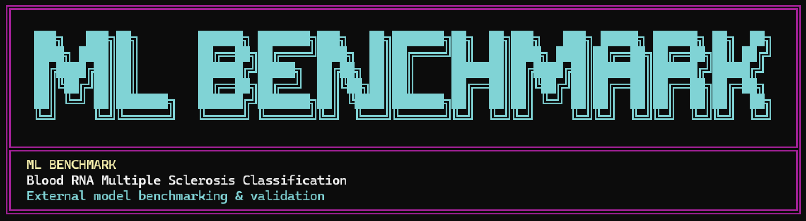

# MS Blood RNA ML Benchmark

A publication-style machine learning benchmarking framework for classifying Multiple Sclerosis (MS) using whole blood RNA expression data.

This project evaluates multiple machine learning algorithms on the publicly available GSE17048 cohort and introduces the **MS Diagnostic Score**, a clinically weighted composite evaluation metric designed to assess model utility beyond standard accuracy alone.


# The Google docs link to the research paper: 
https://docs.google.com/document/d/1nw-o4foh9bFQkOpzV15W3959ZzaMGiOm/edit?usp=sharing&ouid=104443089857599206364&rtpof=true&sd=true

---

## Overview

Machine learning in biomedical research is often evaluated using isolated metrics such as accuracy or AUC-ROC. However, in real clinical settings, different metrics carry different levels of importance.

This project introduces a more clinically aware benchmarking framework by combining:

- Diagnostic discrimination
- Sensitivity to disease detection
- Precision
- Calibration quality
- Generalization performance

into a single weighted scoring system.

The framework benchmarks multiple machine learning models under a standardized evaluation pipeline with:

- Leakage-safe preprocessing
- Feature selection
- Nested cross-validation
- Bootstrap confidence intervals
- Calibration analysis
- ROC analysis
- Statistical comparison testing

---

# Installation
## How to use
1. Download the files from this repository as-is

2. Open terminal at your local copy of the repository folder

3. Run the benchmark
- to run without external models ⤵️
```bash
python3 "ms_ml_benchmark.py"
```

- to run with external models ⤵️
```bash
python3 "ms_ml_benchmark.py" --external-models sample_external_models.py
```

## Results

results will be automatically saved inside the root directory as a new folder `results_publication_grade`

## Explanation
The framework will:

- Load and preprocess the dataset
- Perform feature selection
- Train and evaluate machine learning models
- Generate benchmark metrics
- Create publication-style visualizations
- Save outputs into a `results/` directory

---

## Models Included

The benchmark currently evaluates:

- Logistic Regression
- Random Forest
- XGBoost
- Support Vector Machine (SVM)
- Neural Network (MLP)
- Gradient Boosting
- Naive Bayes
- K-Nearest Neighbors (KNN)
- Stacking Ensemble

---

## Dataset

### Source

This project uses the publicly available GEO dataset:

**GSE17048 — Whole Blood RNA Expression Profiles**

NCBI GEO:
https://www.ncbi.nlm.nih.gov/geo/query/acc.cgi?acc=GSE17048

### Cohort

- 144 patient samples
- Healthy controls
- Relapsing-remitting MS
- Primary progressive MS
- Secondary progressive MS

### Important

The dataset is **included** in this repository.

To use this project, the dataset `GSE17048_series_matrix.txt.gz` must be located/placed it in the project root directory

---

# Features

- Leakage-safe preprocessing pipeline
- Recursive Feature Elimination (RFE)
- Variance-based feature filtering
- Nested cross-validation
- Bootstrap confidence intervals
- ROC curve analysis
- Calibration metrics
- Statistical comparison testing
- Publication-style graph generation

---

# MS Diagnostic Score

The benchmark introduces the **MS Diagnostic Score**, a clinically weighted composite metric designed to evaluate machine learning utility in Multiple Sclerosis classification.

| Metric | Weight |
|---|---|
| AUC-ROC | 30% |
| Recall | 25% |
| F1 Score | 20% |
| Precision | 15% |
| Brier Score | 10% |

---

# Repository Structure

```txt
ms-blood-rna-ml-benchmark/
│
├── ms_ml_benchmark.py
├── requirements.txt
├── README.md
├── LICENSE
│
├── results/
├── examples/
└── docs/
```

---

# Author

**Adam Simson** & **Ankush Dutta**
Synthica Research Group

---

# Disclaimer

This repository is intended for research and educational purposes only.

It is not intended for clinical use, diagnosis, or medical decision-making.

## Clone the Repository

```bash
git clone https://github.com/adamjamiesimson/ms-blood-rna-ml-benchmark.git
cd ms-blood-rna-ml-benchmark
