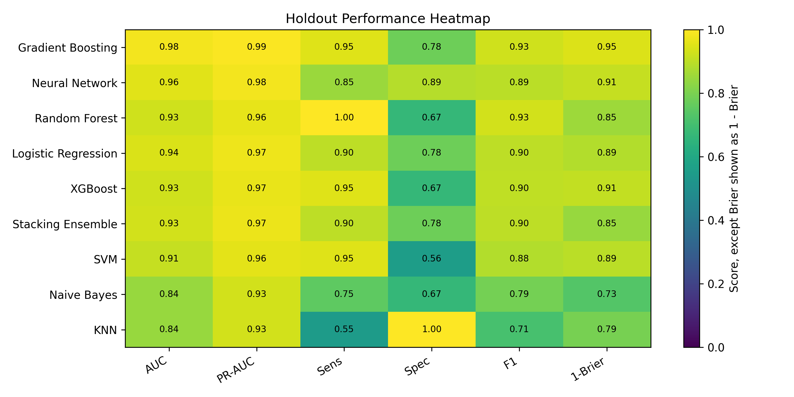
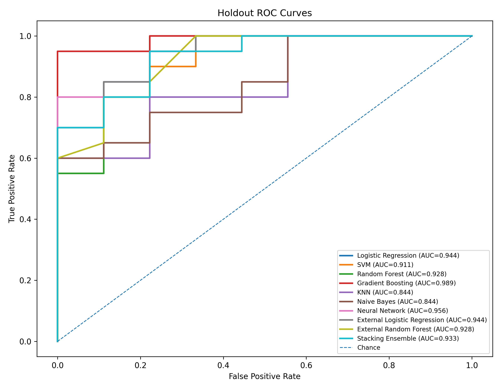
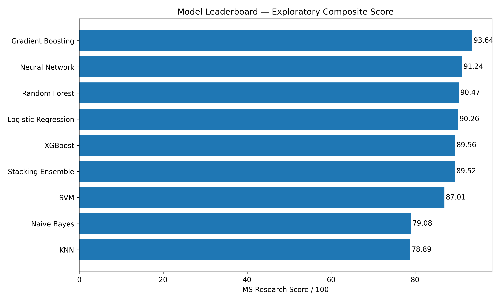

# Sample results

Above attached are results auto-generated from the python script with the in-built sample models.

The results currently showcase the reults of:

- Logistic Regression
- Random Forest
- XGBoost
- Support Vector Machine (SVM)
- Neural Network (MLP)
- Gradient Boosting
- Naive Bayes
- K-Nearest Neighbors (KNN)
- Stacking Ensemble